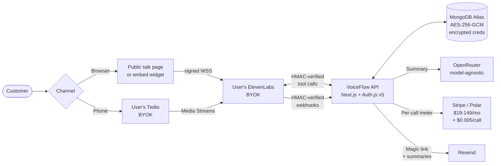

# VoiceFlow

> **AI receptionists that sound human. Bring your own voice account, keep the savings.**

Most AI voice platforms (Vapi, Retell, Bland) mark up voice costs 3–5× and bill you per minute. **VoiceFlow doesn't sell voice.** You bring your own ElevenLabs account directly, pay them what they actually charge, and pay us a flat platform fee for the orchestration layer. The result: **75–85% cheaper at scale**, full cost transparency, and your conversations live in your accounts — not ours.


**Live demo:** _add your production URL_

---

## Why BYOK is the right model

**The competitor model:**
- Platform pays ElevenLabs for voice.
- Platform marks up voice 3–5× and bills users per minute.
- Users have no visibility into actual voice costs.
- Platform takes margin risk if ElevenLabs raises prices.

**VoiceFlow flips this:**
- User pays ElevenLabs directly — their plan, their billing relationship.
- VoiceFlow charges a flat platform fee ($19–149/mo) for orchestration.
- User sees exactly what voice costs them.
- Platform takes no margin risk on voice.

**At 1,000 minutes/month:**

| Platform | Monthly cost |
| --- | --- |
| Vapi | ~$200 |
| Retell | ~$180 |
| **VoiceFlow + ElevenLabs Creator** | **$19 + $11 = $30 (85% cheaper)** |

Billing is **flat platform fee + flat per-call overage** ($0.005/call beyond your plan's included quota), not per-minute — so a 30-second call and a 10-minute call cost the same. Predictable as conversations get longer.

## What it does

- **Browser voice** — visitors open a public agent URL or an embeddable widget, tap "Talk", and speak. Powered by ElevenLabs Conversational AI over a signed, short-lived session.
- **Phone voice (BYOK Twilio)** — Pro+ users connect their own Twilio account and assign a number to an agent. Inbound calls bridge into ElevenLabs via Twilio Media Streams (`<Connect><Stream>` TwiML).
- **Tools that act** — agents book appointments, capture leads, and look up bookings. Tool calls execute on VoiceFlow's servers (HMAC-verified) while voice runs on the user's ElevenLabs account.
- **Per-call summaries** — post-call transcripts are summarised through OpenRouter and emailed to the agent owner.
- **Secure embed** — every widget request carries an HMAC-signed JWT (5-minute TTL) plus a per-agent domain allowlist, so a stolen embed code can't be used elsewhere.
- **Metered billing** — flat Stripe (or Polar) subscriptions + per-call overage via V2 Meter Events.

## Architecture



The key architectural decision: **VoiceFlow never sits in the voice path.** Audio flows directly between the caller, the user's Twilio, and the user's ElevenLabs account. VoiceFlow is the control plane — it provisions agents, verifies and executes tool calls, records transcripts, and bills for orchestration. That's what makes BYOK possible and what keeps platform costs near-zero per minute of voice.

## Tech stack

| Layer | Choice | Why |
| --- | --- | --- |
| Framework | Next.js (latest, App Router) | RSC for cheap server-rendered dashboards, edge-friendly auth |
| Language | TypeScript (strict) | Catch BYOK plumbing mistakes at compile time |
| Auth | Auth.js v5 (`next-auth@beta`) | Google OAuth + Resend magic link, JWT sessions |
| Database | MongoDB Atlas + Mongoose | Flexible schemas for mixed per-user integration shapes |
| Voice | ElevenLabs Conversational AI (BYOK) | Industry-leading natural voices, hosted by the user |
| Phone | Twilio (BYOK, Pro+) | Bring your own telecom — your number, your bill |
| Summaries | OpenRouter (model-agnostic) | Swap models without code changes; ~fractions of a cent/call platform cost |
| Encryption | Node `crypto` + AES-256-GCM | Protect user ElevenLabs/Twilio credentials at rest |
| Widget security | HMAC-SHA256 JWTs + per-agent domain allowlist | Stolen embed codes can't be reused off-domain |
| Billing | Stripe Subscriptions + V2 Meter Events (Polar alternative) | Flat plans + per-call overage; Polar for regions Stripe doesn't serve |
| Observability | Self-hosted ErrorLog + EventLog in MongoDB | No third-party data egress; 30-day TTL |
| Deploy | Vercel | No VPS — ElevenLabs hosts the voice pipeline |
| Package manager | pnpm | Fast, disk-efficient installs |

## Security architecture

- **BYOK credential encryption** — ElevenLabs API keys and Twilio Account SID/Auth Token are encrypted with **AES-256-GCM** ([`src/lib/crypto.ts`](src/lib/crypto.ts)) and decrypted in-memory only at the call site, never logged or rendered in plaintext.
- **Widget security** — embed requests carry **HMAC-SHA256-signed JWTs** with a 5-minute TTL ([`src/lib/hmac.ts`](src/lib/hmac.ts)) plus a **per-agent domain allowlist** ([`src/lib/widget/domain-check.ts`](src/lib/widget/domain-check.ts)). A stolen embed snippet won't initialize on an unauthorized domain.
- **Webhook signatures, all verified** —
  - **ElevenLabs** post-call webhooks: HMAC secret configured **per user** during onboarding ([`verifyElevenLabsSignature`](src/lib/elevenlabs/verify-signature.ts)).
  - **Twilio** request validation against the user's Auth Token.
  - **Stripe** webhooks against the platform signing secret; **Polar** via `validateEvent`.
- **Self-hosted observability** — `ErrorLog` + `EventLog` collections in MongoDB with a 30-day TTL. No third-party error-tracking egress.
- **Auth.js JWT sessions** signed with the platform `AUTH_SECRET`.
- **Per-user isolation** — every outbound ElevenLabs/Twilio API call uses the **requesting user's** encrypted credentials. No master key, no cross-tenant leaks.

## ElevenLabs is BYOK

**VoiceFlow holds no master ElevenLabs API key** — there is no `ELEVENLABS_API_KEY` in the environment. The integration is fully per-user. Each user supplies two values from their ElevenLabs dashboard:

1. **API key** — from [Profile → API Keys](https://elevenlabs.io/app/settings/api-keys), pasted into VoiceFlow's Integrations page. Encrypted with AES-256-GCM at rest, decrypted per-request via [`getElevenLabsClient(userId)`](src/lib/elevenlabs/client.ts).
2. **Post-call webhook secret** — ElevenLabs generates this when the user creates a post-call webhook in their dashboard and shows it once. The user copies it into VoiceFlow; we verify the HMAC signature on every incoming webhook so calls from outside their workspace can't be spoofed.

The agents VoiceFlow creates live in **the user's** ElevenLabs account, not ours.

### Sanity-check the integration

After connecting your ElevenLabs key, hit `GET /api/internal/elevenlabs-test` (signed-in; reads only the caller's own integration). Returns `{ ok: true, voiceCount, tier, charactersUsed, … }` on success, or a clean `INTEGRATION_DISCONNECTED` error if the key isn't connected.

## Twilio is BYOK too

**Phone calling is gated behind the Pro plan.** On Pro/Business, users connect their own Twilio account — VoiceFlow stores Account SID + Auth Token AES-256-GCM-encrypted. From an agent's **Channels** tab they pick one of their Twilio numbers; we point that number's Voice webhook at `/api/twilio/incoming?agentId=...` and provision a phone-side ElevenLabs agent in their account on first assign.

### BYOK Twilio billing model

- **You pay Twilio** directly: ~$1/mo per number + ~$0.014/min inbound (US).
- **You pay ElevenLabs** based on your character usage (their pricing).
- **You pay VoiceFlow** a flat plan ($49/mo Pro or $149/mo Business) + $0.005/call overage.
- **Total predictable cost** with full visibility into each of the three components. We never mark up Twilio or ElevenLabs.

If you disconnect Twilio, we clear the webhook on every phone-enabled agent first, then delete the encrypted creds — your numbers stay in your account exactly as they were.

## Local setup

**Prerequisites:** Node.js 22+, pnpm 10+, a MongoDB Atlas cluster, and accounts at: ElevenLabs (Creator+), Twilio (optional — phone testing), Stripe (test mode), Resend, Google OAuth, OpenRouter.

```bash
# 1. Clone + install
git clone https://github.com/RakibulIslamm/voice-flow-elevenlabs
cd voice-flow-elevenlabs
pnpm install

# 2. Environment
cp .env.example .env.local

# Generate the three platform secrets (unique per environment):
openssl rand -hex 32   # ENCRYPTION_KEY  (64 hex chars / 32 bytes)
openssl rand -base64 32 # AUTH_SECRET
openssl rand -base64 32 # WIDGET_SIGNING_SECRET
# Fill the rest of .env.local per the grouped sections in .env.example.

# 3. Tunnel for OAuth + webhook callbacks during local dev
ngrok http 3000   # use the https URL for Google OAuth + Stripe webhook

# 4. Run
pnpm dev
```

Visit [http://localhost:3000](http://localhost:3000), sign up, then **connect YOUR ElevenLabs key in Integrations** — nothing voice-related works until a user brings their own key.

| Command | What it does |
| --- | --- |
| `pnpm dev` | Start the dev server (port 3000) |
| `pnpm build` | Production build |
| `pnpm start` | Run the production build |
| `pnpm lint` | ESLint |
| `pnpm typecheck` | TypeScript strict check (no emit) |
| `pnpm format` | Prettier write |
| `pnpm format:check` | Verify formatting |

## Deploy to Vercel

1. Push to GitHub, then connect the repo as a Vercel project.
2. Add all environment variables from `.env.local` in the Vercel dashboard.
3. **⚠️ CRITICAL — regenerate these secrets for production. Never reuse dev values:**
   `AUTH_SECRET`, `ENCRYPTION_KEY`, `WIDGET_SIGNING_SECRET`, `ELEVENLABS_WEBHOOK_SECRET`.
   The same `ENCRYPTION_KEY` is required to decrypt stored credentials — **lose it and every user's encrypted ElevenLabs/Twilio creds become unrecoverable.** Store all four in a password manager.
4. Set `NEXT_PUBLIC_APP_URL` to your production domain and configure the custom domain in Vercel.
5. **Verify there is NO `ELEVENLABS_API_KEY`** in the Vercel env panel — its absence is what confirms the BYOK model.
6. **Google OAuth** — add `https://your-domain.com/api/auth/callback/google` to the authorized redirect URIs (keep the dev URL too).
7. **Stripe webhook** — add endpoint `https://your-domain.com/api/stripe/webhook` subscribed to `checkout.session.completed`, `customer.subscription.updated`, `customer.subscription.deleted`, `invoice.paid`, `invoice.payment_failed`. Copy the production signing secret into `STRIPE_WEBHOOK_SECRET` (overwrite the dev value).
8. **Resend** — verify your sending domain for magic-link + transactional email.
9. **ElevenLabs webhook** — there is nothing to configure platform-side. **Each user** sets up their own post-call webhook when they connect ElevenLabs; the secret is shown in the Integrations card after connect.

> **Billing provider switch:** Stripe is the default. Set `POLAR_SDK=true` to route the entire app through Polar instead (for regions where Stripe isn't available) — webhooks, checkout, and plan changes all switch with the one flag.

## Admin access

Admin is a per-user flag in MongoDB — no self-serve promotion:

```bash
mongosh "<your-mongodb-uri>" --quiet --eval \
  'db.users.updateOne({email: "you@example.com"}, {$set: {isAdmin: true}})'
```

Sign out and back in to refresh the JWT — the `isAdmin: true` claim takes effect on the next session. The `/admin` link then appears in the sidebar.

## Landing page live demo

The landing page (`/`) can embed a real talk widget in the **Live demo** block (it loads `/talk/<slug>?embed=1` in an iframe). To enable it: sign up on production → connect ElevenLabs → create a "VoiceFlow Demo" agent (template `dental`) → allowlist your production domain → set `NEXT_PUBLIC_DEMO_AGENT_SLUG` (or edit the constant in [`src/components/marketing/demo-block.tsx`](src/components/marketing/demo-block.tsx)). Until that agent exists the block degrades gracefully to the widget's "unavailable" state.

## Project structure

```
src/
├── app/              # App Router (auth, marketing, dashboard, admin, talk, api)
├── components/       # shadcn UI primitives + feature-grouped components
├── lib/              # Cross-cutting: auth, db, elevenlabs, twilio, billing, ai, email, crypto, hmac
├── hooks/            # Reusable React hooks
├── server/           # Server-only actions & queries
└── types/            # Shared TypeScript types

widget/               # Standalone embed widget (builds to public/widget.js)
```

## What I'd build next (at Series-A scale)

- **Multi-tenant ElevenLabs pooling** — let a team share one ElevenLabs subscription across multiple users.
- **Custom voice cloning workflow** — guided onboarding to clone the user's brand voice directly into their ElevenLabs account.
- **Outbound calling** — proactive AI calls for cold outreach, follow-ups, and appointment reminders.
- **Multi-language support** — 50+ languages via ElevenLabs (Bengali, Spanish, German, …).
- **Call recording with consent** — store recordings in the user's own S3/R2 bucket (BYOK storage too).
- **Distributed tracing** — across enqueue → ElevenLabs → tool callback → execute.
- **Per-step retry policies** — configurable per agent (e.g. retry `book_appointment` on transient failures).
- **Customer-facing webhook events** — let users subscribe to `call.completed`, `capture.created` for their own integrations.
- **Voice marketplace** — let users share/sell cloned voices (revenue share with ElevenLabs).
- **Smart routing** — multi-agent workflows where agents transfer to specialized agents (escalation).

## Footer

Built by **Rakibul Islam** · [LinkedIn](https://www.linkedin.com/in/rakibulislam) · [GitHub](https://github.com/RakibulIslam) · Open to AI engineering / freelance via Toptal · Arc.dev · DMs welcome.

Licensed under the [MIT License](LICENSE).
